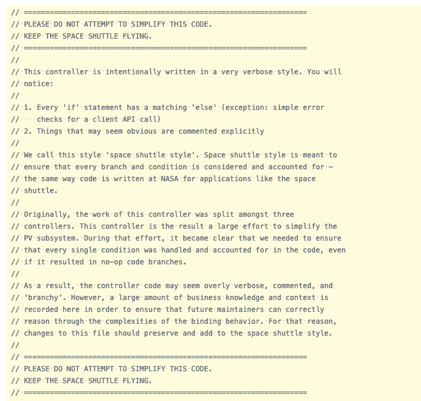
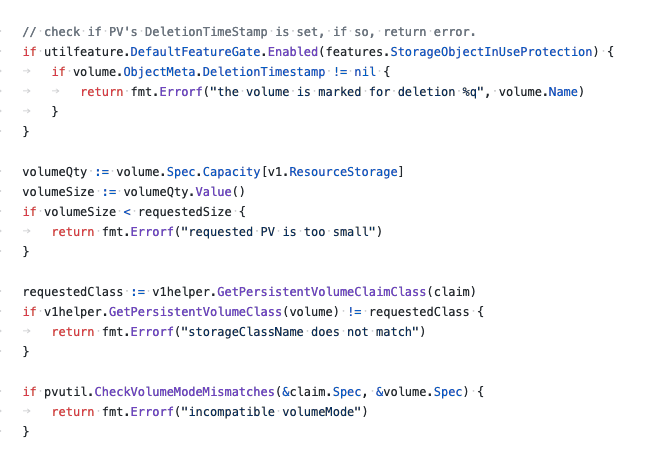

## Introduction

The internet contains countless debates and arguments about what good code _is_. Tabs vs. Space. Lots of comments vs. self documenting functions. `if/else` vs `switch/case`. The list goes on and on, but the usefulness of these debates is hardly ever clear. Instead, we occilate based on what the newest langauge prefers or what the now-in-vogue framework does. And yet we continue to have bad code. How can this be?

### Why another "clean code" book?

Let's think about an experiment, one purely based in conjecture and surely not representative of real life. Let's say that the seminal work on writing clean code was written while the George Bush Jr. was still in office - let's just say it's in August. Obama is a couple months from being elected, Blogger is the most popular website in the United States, and the iPhone has just hit it's third generation. Coding bootcamps weren't really a thing and Stack Overflow was still a couple months from being launched. In such a hypothetical, it would be highly questionable to continue to religiously reference that book and it's content. Now, just for fun, let's imagine we are in the current year (2020 at the time of writing) and within the tech field there are still massive problems for people of color, women, and LGBTQ+ folks. The author of that 2008 book has, theoretically, been known as particularly vitriolic and harmful towards those groups for quite some time. Despite all these facts, let's imagine this book has continued to be recommended to many new inductees into the field of Software Engineering. 

In this hypothetical, it would seem that there is a need for a new book on the topic, would it not?

### What does Clear Code even mean?

Clear code, in contrast to "clean" code is code that is written to express clarity above all else. Code clarity is the result of intentional decisions about architecture, formatting, and communication made within a team and a codebase. This book is designed to act as a guide to the conversations you can have with your team about making your code clear and to provide examples of what clear code will look like for many organization.

#### Clear Code vs Clean Code

I find examples to be the best tool for explaining concepts, especially related to code. Here I want to present a quick example of _clear code_, and show how it differs from _clean code_.
The original "clean code" book says that `if/else` statements are a code smell, since it means your functions are doing more than one thing. In many codebases this kind of heuristic does provide clearer code, however one doesn't have to look far to find a great example of this breaking down. In the Kubernetes source code, we can find incredibly _clear code_, that doesn't meet the definition of _clean code_.

**Great, clear documentation**

<figure>

<figcaption>

Good documentation is a core tenet of Clear Code. Large blocks of documentation like this are often abstracted out into knowledge base systems, which reduces their clearness. More on this in LINK</figcaption>
</figure>

<!-- TODO: Link here -->

**Clear, but not "clean"**

<figure>

<figcaption>

Combined with good documentation and reasoning, lots of `if` statements quickly move into clear code territory, even when they wouldn't typically be considered "clean"
</figcaption>
</figure>

### A Systems approach

<!-- TODO: This section is long and not super relavant. I likely will distill the information her einto a quick description of systems. -->

"Thinking in Systems" by Donella Meadows is the seminal work on systems thinking - the process of analyzing the systems that exist around us and learning to make tweaks that change the system. Systems exist all across our lives - our companies, the traffic we sit in, and the trees by the side of the road are all systems. In her book, Donella presents the idea that systems can be broken into three major categories: _elements_, _interconnections_, and _function/purpose_.

Elements are the individual pieces that make up a system - your coworkers, the cars around you, and the cells of the tree are all elements of the system. Interconnections are the what holds elements together - corporate hierarchy, traffic laws, and the metabolic processes of the tree. Finally, function/purpose is the reason that a system exists - to produce profit, to insure the safety of people on the road, and the propagation of more trees. While elements are usually fairly easy to see, interconnections and functions (which we will use instead of purpose moving forward) are often obscured and require time spent looking at the system.

This book is concerned with the systems that impact the quality and readability of our code. At the end of each major idea in this book, you will find clear cut examples of a system - with it's elements, interconnections, and function - along with system tweaks I have seen work well across organizations.

The other key aspects of systems thinking are stocks, flows, and feedback loops. Stocks are observable/quantifiable parts of a system. Flows determine stock levels. A good example of this is in a code system: stock could be the number of bugs you have. An inflow is the creation of new bugs. An outflow occurs when fixing bugs. Stocks and flows aren't always clear, but with a bit of attention to the system, we can usually find some kind of stock and flow. A feedback loop is a process by which flows are triggered by a change in stock. Feedback loops can increase, decrease, or maintain stock levels. In our bug example, adding new code to poorly designed architecture could lead to far more bugs, increasing the stock significantly. A rewrite of some architecture could decrease the amount of bugs, decreasing the stock.

## What lies within

A wise Rubyist once waxed that a book is supposed to start with *synergy* - at this point in the book, you and I should be getting along well. You should trust me to lead you through this book. However, while this introduction has introduced the concept of clear code, it has yet to introduce me. Without further ado:

Howdy, I'm **wuz**, has-been wizard and hopefully the person to help you bring clarity to your code. I've been writing software for over 10 years now. In those years, I've written a lot of code. However, in that time I have read much more code than I've written. Here is the first foundational truth of clear code: all developers, given enough time in the profession, will read more code than they will ever write. The more code I have read, the more I've tried to recognize good, clear code and replicate it. 

I've worked in PHP, Angular, React, Ruby, Python, and on and on. So many languages, so many paradigms... And yet, so many similarities. I've spent the last few years working closely with other developers - teaching and learning in kind. This is the second foundational truth of clear code - all developers, given time, will talk and write about code far more than they will write code. 

I've spent time writing, reading, and communicating about code at startups and larger companies. I've done app development contract work, enterprise software, and built marketing websites. Many of these code bases lacked clarity, something I've grown to both regret and better understand. Here, the third foundational truth of clear code: all developers, given enough time, will have to weigh the opportunity cost of writing clear code. Sometimes, creating clear code will not be worth it. That's ok.

Ok, hopefully we are on the same page now. Let's head to the next one together.

---