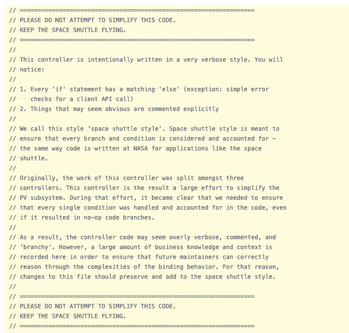
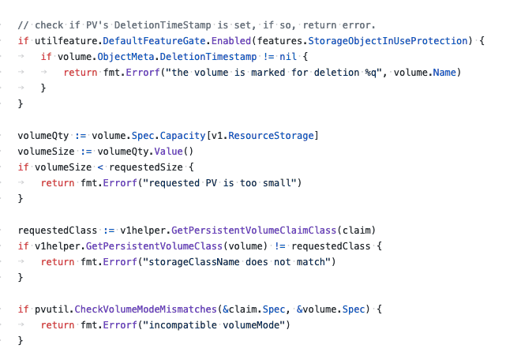

# Clear Code

## Introduction

The internet contains countless debates and arguments about what good code *is*. Tabs vs. Space. Lots of comments vs. self documenting functions. `if/else` vs `switch/case`. The list goes on and on, but the usefulness of these debates is hardly ever clear. Instead, we occilate based on what the newest langauge prefers or what the now-in-vogue framework does. And yet we continue to have bad code.

### Why another "clean code" book?

Clean Code, by "Uncle" Bob Martin, has now been out for 12 years. It was released when Bush Jr. was still in office. The world of programming has changed significantly - there are more new devs trying to navigate this world than ever and the options available to them are fairly lacking. Not to mention "Uncle" Bob has proven time and time again that he sets a poor moral example for incoming developers. Despite all of this, Clean Code remains a highly rated and ubiquitous introduction to the craft of software engineering. I think it's time for that to change. This book sets out to help 

### What does Clear Code even mean?

Clear code, in contrast to "clean" code is code that is written to express clarity above all else. Code clarity is the result of intentional decisions about architecture, formatting, and communication made within a team. This book is designed to act as a guide to the conversations you can have with your team about making your code clear and to provide examples of what clear code will look like for many organization. 

#### Clear Code vs Clean Code

I find examples to be the best tool for explaining concepts, especially related to code. Here I want to present a quick example of *clear code*, and show how it differs from *clean code*.
The original "clean code" book says you should prefer rely on polymorphism over `if/else` and `switch/case` statements. In many codebases this does provide clearer code, however one doesn't have to look far to find a great example of this breaking down. In the Kubernetes source code, we can find incredibly *clear code*, that doesn't meet the definition of *clean code*. 

\newpage

**Great, clear documentation**

**Clear, but not "clean"**

\newpage

### A Systems approach

"Thinking in Systems" by Donella Meadows is the seminal work on systems thinking - the process of analyzing the systems that exist around us and learning to make tweaks that change the system. Systems exist all across our lives - our companies, the traffic we sit in, and the trees by the side of the road are all systems. In her book, Donella presents the idea that systems can be broken into three major categories: _elements_, _interconnections_, and _function/purpose_.

Elements are the individual pieces that make up a system - your coworkers, the cars around you, and the cells of the tree are all elements of the system. Interconnections are the what holds elements together - corporate hierarchy, traffic laws, and the metabolic processes of the tree. Finally, function/purpose is the reason that a system exists - to produce profit, to insure the safety of people on the road, and the propagation of more trees. While elements are usually fairly easy to see, interconnections and functions (which we will use instead of purpose moving forward) are often obscured and require time spent looking at the system.

This book is concerned with the systems that impact the quality and readability of our code. At the end of each major idea in this book, you will find clear cut examples of a system - with it's elements, interconnections, and function - along with system tweaks I have seen work well across organizations.

The other key aspects of systems thinking are stocks, flows, and feedback loops. Stocks are observable/quantifiable parts of a system. Flows determine stock levels. A good example of this is in a code system: stock could be the number of bugs you have. An inflow is the creation of new bugs. An outflow occurs when fixing bugs. Stocks and flows aren't always clear, but with a bit of attention to the system, we can usually find some kind of stock and flow. A feedback loop is a process by which flows are triggered by a change in stock. Feedback loops can increase, decrease, or maintain stock levels. In our bug example, adding new code to poorly designed architecture could lead to far more bugs, increasing the stock significantly. A rewrite of some architecture could decrease the amount of bugs, decreasing the stock.

## Don't do too much.

*In progress*

## Write Everything Twice

In the world of programming, there may be no more widely recognizable than Don't Repeat Yourself (DRY). It's the subject of many a code review and you can find any number of articles explaining why DRY is the holy grail of programming. It's also wrong.

Alright, clickbait aside, let's dive into what DRY is, what good parts exist, and a better alternative.

### Left high and DRY

DRY, in technical terms, is a system by which every "piece of knowledge" has a single, unambigous representation within a system.

## Always comment your abstractions

*In progress*

## Optimize for deletion

*In progress*

## Perfect is the enemy of working

*In progress*

## Deadlines wait for no dev

Never attribute to lack of thought that which you can attribute to opportunity cost.

## Smells

*In progress*

## Misc

*In progress*

### Use a formatter. Use a linter.

https://gist.github.com/wojteklu/73c6914cc446146b8b533c0988cf8d29
https://www.investigatii.md/uploads/resurse/Clean_Code.pdf
https://twitter.com/williampietri/status/1187013084465885184
